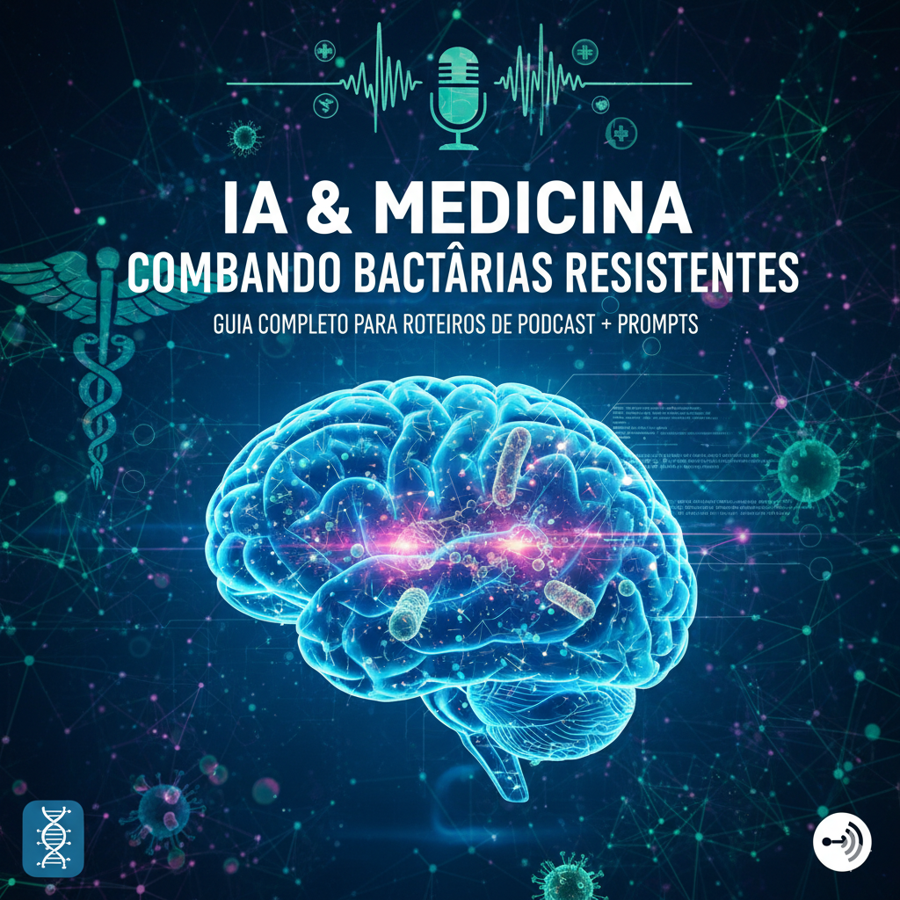

# 🎙️ Podcast Prompts — Guia passo a passo



Este projeto contém prompts e exemplos práticos para criar roteiros de podcast sobre IA e medicina.

# Podcast Prompts — Guia passo a passo

Repositório: `podcast-prompts`

Este arquivo contém **prompts prontos e estruturados** para criar roteiros de podcast de forma prática — desde a concepção até o script final. Inclui exemplos (templates) para diferentes estilos (entrevista, narrativa, educativo), formatos de saída (teleprompter, roteiro curto, show notes em Markdown), dicas de revisão, checklist de segurança (sobre conteúdo sensível) e sugestão de capa (`cover.png`).

---

## Estrutura do repositório sugerida

- `README.md` (este arquivo)  
- `prompts/`  
  - `01_concepção.md`  
  - `02_estrutura_episodio.md`  
  - `03_falas_teleprompter.md`  
  - `04_perguntas_entrevista.md`  
  - `05_show_notes.md`  
- `assets/cover.png`  

---

## Como usar estes prompts

1. **Escolha o template** que mais se aproxima do seu objetivo (entrevista, solo, narrativa, painel).
2. **Edite as variáveis** (título, tom, duração desejada, público-alvo, presença de convidados).
3. **Execute o prompt** no modelo de linguagem (ex.: ChatGPT) e revise o texto gerado.
4. **Peça refinamentos**: ajustes de tom, corte de tempo, transformação em teleprompter, versões curta/longa.
5. **Faça revisão de segurança** quando o tópico envolver saúde, biologia, finanças, legal — siga as recomendações de segurança abaixo.

---

## Prompt base — definição do episódio (template)

```
TÍTULO: "{título_do_episodio}"
DURAÇÃO: {minutos} minutos
PÚBLICO-ALVO: {descrição_breve_do_publico}
FORMATO: {entrevista | solo | narrativa | painel}
TOM: {informal | técnico | inspirador | jornalístico}
OBJETIVO: {objetivo_principal_do_episodio}
CONVIDADOS: {nome - função - 1 frase de bio}

INSTRUÇÃO AO MODELO:
1) Gere uma estrutura de episódio com blocos temporais (introdução, 2–4 blocos, entrevista, encerramento).
2) Para cada bloco, descreva **objetivo**, **duração estimada**, e **falas do apresentador** (apenas texto das falas).
3) Inclua uma versão curta (30–60s) para redes sociais.
4) Inclua sugestões de 5 perguntas para o convidado.
5) Forneça show notes em formato Markdown (título, resumo de 2–3 linhas, tópicos, leituras sugeridas).

Responda apenas com o texto do roteiro (sem instruções de produção). Use linguagem clara e natural.
```

---

## Exemplos de prompts práticos (prontos para colar)

### 1) Roteiro solo — educativo (30 min)

```
TÍTULO: "IA e a nova fronteira das terapias contra bactérias"
DURAÇÃO: 30 minutos
PÚBLICO-ALVO: ouvintes gerais interessados em saúde e tecnologia
FORMATO: solo com trechos de entrevista simulada
TOM: acessível e cauteloso
OBJETIVO: explicar, em linguagem leiga, como a IA auxilia pesquisas em terapias antimicrobianas sem fornecer instruções laboratoriais

INSTRUÇÃO AO MODELO:
Siga o Prompt base (gerar estrutura, falas apenas, mostrar versão curta e show notes). Responda apenas com as falas do apresentador e trechos de fala simulada de especialistas.
```

### 2) Entrevista técnica — jornalista (45 min)

```
TÍTULO: "Bioinformática e IA: do laboratório ao hospital"
DURAÇÃO: 45 minutos
PÚBLICO-ALVO: profissionais de saúde e tecnologia
FORMATO: entrevista com 2 especialistas
TOM: jornalístico e aprofundado
OBJETIVO: explorar casos de uso, limitações e governança
CONVIDADOS: Dr. Ana Silva - Microbiologista; Dr. João Costa - Cientista de dados

INSTRUÇÃO AO MODELO:
Gerar blocos com perguntas para cada convidado, respostas simuladas curtas (máx 3 parágrafos) e um resumo final com pontos de ação. Incluir show notes e 3 sugestões de leituras acadêmicas (sem links diretos).
```

---

## Templates de prompts para transformação/edição

- **Transformar em teleprompter:**  
  `"Pegue o roteiro e transforme em formato teleprompter: quebre em linhas curtas, marque pausas, indique ênfases e tempo estimado por bloco."`

- **Gerar versão curta (social media):**  
  `"Resuma os principais 3 pontos do episódio em 45 segundos, tom afirmativo, com chamada para ação no final."`

- **Gerar show notes:**  
  `"Crie show notes em Markdown: título, resumo (2–3 linhas), tópicos discutidos, 5 hashtags, leituras sugeridas."`

- **Ajustar tom:**  
  `"Reescreva o texto para um tom mais informal/mais técnico/mais inspirador"`

- **Criar perguntas para convidado:**  
  `"Gere 8 perguntas de entrevista: 3 introdutórias, 3 técnicas, 2 sobre visões futuras e ética."`

---

## Checklist de segurança (obrigatório para temas sensíveis)

1. **Não pedir instruções operacionais** ou protocolos laboratoriais ou passos práticos para manipulação de agentes biológicos.  
2. **Evitar dados que possam ser usados para causar dano** (protocolos, sequências, quantidades, parâmetros experimentais).  
3. **Incluir disclaimer** no show notes quando o tema envolver saúde/biologia: "Este conteúdo é informativo e não substitui orientação profissional. Não fornece instruções técnicas nem protocolos."  
4. **Quando usar entrevistas, prefira especialistas verificados** e cite apenas conceitos de alto nível.  
5. **Revisão final por um especialista humano** para evitar imprecisões em temas altamente técnicos.

---

## Exemplos de formatos de saída (incluir no prompt se quiser)

- `"Falas: somente texto das falas, sem anotações de produção."`
- `"Teleprompter: linhas curtas, marcação de pausas (… 2s), ênfases entre *asteriscos*."`
- `"JSON: {title, duration_min, blocks: [{name, start_min, end_min, script}], show_notes}"`

---

## Sugestões de revisão e workflow

1. **Rodada 1 (geração):** gere o roteiro bruto com o prompt base.
2. **Rodada 2 (refino):** peça ajuste de tom, cortar 10–20% para tempo, transformar em teleprompter.
3. **Rodada 3 (checagem):** verifique factualidade e segurança; peça exemplos simples para explicar conceitos complexos.
4. **Rodada 4 (final):** gere show notes, título alternativos e descrição para plataformas.

---

## Licença

Sinta-se livre para usar e adaptar estes prompts (CC0-like). Se redistribuir, considere manter créditos.

---

## Nota final

Este repositório contém **apenas prompts e materiais de produção de conteúdo**. Para tópicos sensíveis (como biomedicina), siga o checklist de segurança e não peça conteúdo que ensine manipulação de agentes biológicos. Se precisar, posso gerar arquivos individuais dentro da pasta `prompts/` com exemplos prontos.
